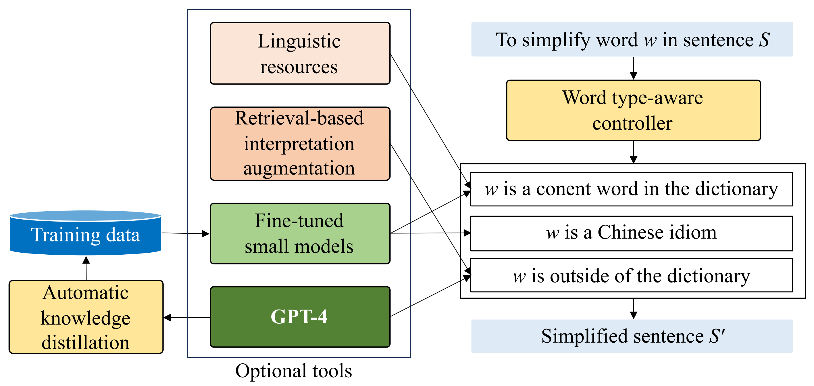
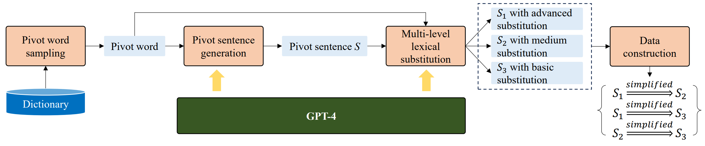

# Hyb-CLS : Optimizing Chinese Lexical Simplification Across Word Types

Our work has been accepted at **EMNLP 2024-Main**. For more details, check out our [Paper]("https://openreview.net/pdf?id=8LiACxLWuv")
📑 .


## Introduction

<p align="center">
  <b> The general framework of the proposed word type-aware Chinese lexical simplification method.</b> <br> <br>
  
</p>

- **Lexical simplification (LS)** is the task of replacing complex words in a sentence with simpler alternatives while preserving the original meaning and structure. **CLS** refers to **Chinese lexical simplification**.
- We found that the model's performance varies based on the type of complex words: **Complex Content words** from the dictionary, **Chinese idioms** and **out-of-dictionary (OOD) words**.
- A major challenge in CLS is the scarcity of data resources. To address this, We propose an **automatic knowledge distillation framework** called **PivotKD**, which generates training data to fine-tune smaller models.

<p align="center">
  <b>The main workflow of the PivotKD framework for generating CLS data based on GPT-4.</b> <br> <br>
  
</p>

- We also implement a **retrieval-based interpretation augmentation (RIA)** strategy, injecting word interpretations from external resources (Chinese synonym thesaurus & search engine) into the context.
- Our findings suggest that a hybrid approach **(Hyb-CLS)** can optimize CLS performance  while managing inference costs by configuring choices like model scale, linguistic resources, and RIA based on specific word types to achieve an ideal balance.

## News

- 2024.10.08 : Code from our experiments is now available.

## 🗂️ Dataset
The dataset was created using the PivotKD framework. After post-processing, it consists of 13,134 entries formatted as questions and instructions to better align with modern large models.
The dataset can be found in the `output/` directory:
- `train_dataset.json` : Training dataset formatted as Q & A.
- `train_dataset_ria.json` : A version that word interpretations are injected into Q.

Key fields in the dataset:

- `question` : The instruction-style input question for model.
- `answer` : The corresponding answer.
- `source` : The original complex word to be simplified.
- `type` : : Type of the complex word.
- `interpretation` : The word’s definition (sourced from Xinhua Dictionary).

The raw distilled data before post-processing is also available in the `output/distillation/` directory.

## 💻 Run locally
### 🛠 Environment and Requirements
We used [Llama-Factory](https://github.com/hiyouga/LLaMA-Factory) 
to fine-tune Qwen-Chat and ChatGLM. 
Environment setup refers to the official 📦 [Installation Guide](https://github.com/hiyouga/LLaMA-Factory?tab=readme-ov-file#installation).
The environment also fits fine-tuning for ChatYuan.

Additionally, model files is encouraged to download locally from Hugging Face. ( [ChatYuan-large-v2](https://huggingface.co/ClueAI/ChatYuan-large-v2) & [chatglm2-6b](https://huggingface.co/THUDM/chatglm2-6b) & [Qwen1.5-7B-Chat](https://huggingface.co/Qwen/Qwen1.5-7B-Chat) )

> We’ve provided distilled results from ChatGPT along with the dataset. If you wish to reproduce distillation section, please add your own `api_base` and `api_key` in `utils.py` from the root directory, then run `sample_pivot.py`, `chatgpt_distillation.py` and `generate_dataset.py` respectively.

> Search engine results used in the RIA method are saved in the `output/crawler/` directory. To reproduce this part, install `beautifulsoup4` and `aiohttp` libraries, and run the crawlers in the `crawler/` directory for your desired search engine.

### 📖 Training
Before training, copy the `train_dataset.json` file into the `data/` directory within the Llama-Factory project and [register](https://github.com/hiyouga/LLaMA-Factory/tree/main/data#supervised-fine-tuning-dataset) the following code in the `dataset_info.json` :
```
"train_dataset": {
    "file_name": "train_dataset.json",
    "columns": {
      "prompt": "question",
      "query": "",
      "response": "answer",
      "history": ""
    }
},
```
To fine-tune Qwen-Chat and ChatGLM, its suggested to follow the Llama-Factory official guide and set the hyperparameters provided in our paper. Here’s an example of the command for fine-tuning Qwen-Chat:
```
python src/train_bash.py \
    --stage sft \
    --do_train \
    --model_name_or_path {model_name_or_path} \
    --dataset train_dataset \
    --template default \
    --finetuning_type lora \
    --lora_target q_proj,v_proj \
    --output_dir {output_dir} \
    --overwrite_cache \
    --per_device_train_batch_size 16 \
    --gradient_accumulation_steps 1 \
    --lr_scheduler_type cosine \
    --logging_steps 100 \
    --save_steps 1000 \
    --learning_rate 5e-5 \
    --num_train_epochs 3.0 \
    --plot_loss \
    --fp16 \
    --seed 2024
```
For ChatYuan, run the fine-tuning directly via `train/chatyuan/train_bash.sh` .

### 📈 Evaluation
Copy the test scripts `test/test_HanLS_{model}.py` to the Llama-Factory root directory and execute:
```
python test_HanLS_{model}.py \
    --stage sft \
    --model_name_or_path {model_name_or_path} \
    --adapter_name_or_path {adapter_name_or_path} \
    --do_predict \
    --dataset train_dataset \
    --finetuning_type full \
    --output_dir {output_dir} \
    --per_device_eval_batch_size 16 \
    --predict_with_generate \
    --template default \
    --fp16
```
The `--adapter_name_or_path` should correspond to the `--output_dir` from the training command.

> We also provide few-shot testing scripts, named as  `test_HanLS_{model}_fewshot.py` . To run these, simply remove the `--adapter_name_or_path` argument. Few-shot results are stored in the `output/fewshot/` directory。

Prediction results for all fine-tuned models are saved in the `output/supervision/` directory.

### 🧠 Human Annotation
We’ve included an automated Python script, `create_annotation.py` , to generate an Excel file for human annotation. The scoring fields are as follows:
Feild     | Description
-------- | -----
**Complexity**  | The substitute is simpler than the complex word.
**Fluency**  |  The sentence, when replaced withthe substitute, remains fluent and natural.
**Semantics**  | The substitute expresses the same meaning as the complex word in the sentence.


After annotation, run `read_annotation_result.py` to generate statistical results.

## Citation

If you find our work helpful, feel free to give us a cite.
